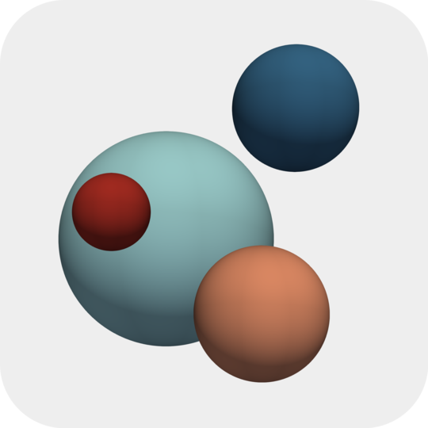

# PartExa - A Particle Library for the Exa-Scale

PartExa is an open-source particle library written in C++ using state-of-the-art programming techniques. PartExa strongly depends on the finite element library [deal.II](https://www.dealii.org/) along with [p4est](https://www.p4est.org/) for parallel distributed adaptive quadtrees and octrees. deal.II provides basic particle functionality with a strong focus on efficient data structures and aspects of parallelization.

The major features of PartExa include
* generic neighbor search algorithms for particle-particle, particle-cell, particle-face, and particle-vertex pairs,
* multiple phases and transition of particles between phases,
* cluster of particles that are connected by (rigid) bonds, and
* evaluation routines for a variety of particle methods such as the Discrete Element Method (DEM), Smoothed Particle Hydrodynamics (SPH), and Peridynamics (PD).

Making use of the sophisticated interfaces and data structures provided by deal.II facilitates the coupling of PartExa with other deal.II-based programs.

## Documentation

A source code documentation of PartExa is provided with [Doxygen](https://partexa.github.io/PartExa-Doxygen/).
The test coverage of PartExa is given in this [coverage report](https://partexa.github.io/PartExa-Coverage/).

## Continuous Integration

## Releases

PartExa is still at the beginning of its journey and under active development. Accordingly, the description above outlines the objectives of PartExa.

## License

PartExa is licensed under the [GNU General Public License v3.0](LICENSE).

This program is free software: you can redistribute it and/or modify it under the terms of the GNU General Public License as published by the Free Software Foundation, either version 3 of the License, or (at your option) any later version.
